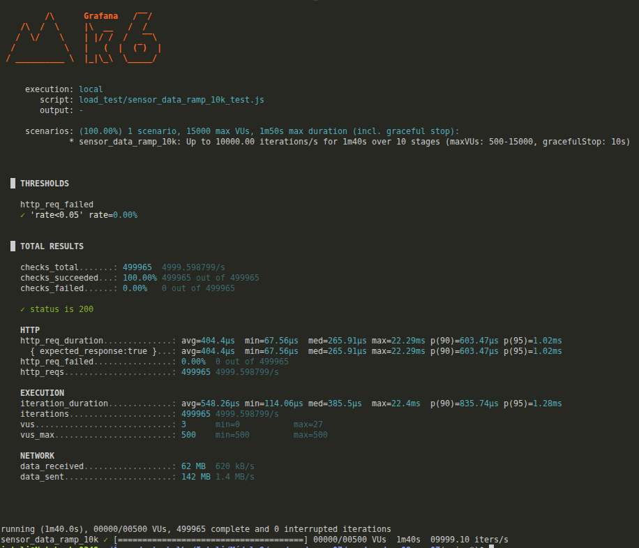
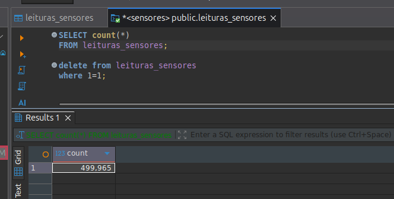
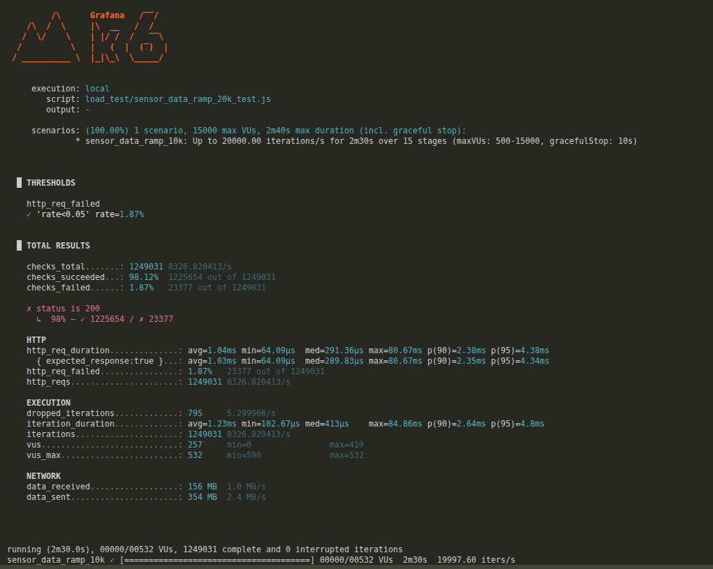
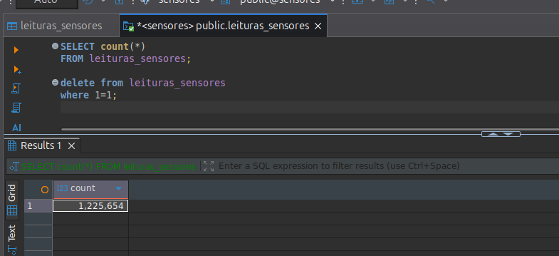

# Resultados dos testes de carga (k6)

Este documento resume os testes de carga executados na rota `POST /sensor_data`, com validação de resposta da API e conferência de persistência no PostgreSQL.

Durante os testes, cada componente do sistema (`backend`, `middleware`, `postgres` e `rabbitmq`) foi executado com limite de `2GB` de RAM, totalizando `8GB` alocados no ambiente.

## Configuração geral

- Ferramenta: `k6` (execução local)
- Endpoint testado: `http://localhost:8080/sensor_data`
- Payload: JSON com `id_dispositivo`, `timestamp`, `tipo_sensor`, `tipo_leitura` e `valor`
- Critério de aceitação: `http_req_failed < 5%`
- Verificação adicional: contagem de linhas no banco após os testes

## Cenário 10k req/s

### Parâmetros do teste

- Rampa progressiva até `10.000 req/s`
- `stage_duration`: `10s`
- Duração total aproximada: `1m40s` (+ `10s` de graceful stop)

### Resultado observado

- `http_req_failed`: `0.00%` (aprovado no threshold)
- Requests totais: `499.938`
- Throughput médio: `~4.999 req/s`
- Latência `http_req_duration`: média `397µs`, p95 `~965µs`
- Status `200`: `100%`

### Conclusão

O sistema se manteve estável nesse perfil, sem falhas e com baixa latência. A evidência de banco confirma que os dados processados foram persistidos.

### Evidências

**Resultado do teste (terminal)**

**Contagem no banco (PostgreSQL)**

---

## Cenário 20k req/s

### Parâmetros do teste

- Rampa progressiva até `20.000 req/s`
- `stage_duration`: `10s`
- Duração total aproximada: `2m30s` (+ `10s` de graceful stop)

### Resultado observado

- `http_req_failed`: `1.87%` (ainda dentro do threshold de 5%)
- Requests totais: `1.249.031`
- Throughput médio: `~8.326 req/s`
- Latência `http_req_duration`: média `1.04ms`, p95 `4.38ms`
- `dropped_iterations`: `795` (baixo para o volume executado)
- Status `200`: `98.12%`

### Conclusão

O sistema sustentou carga mais alta com pequena taxa de erro, mantendo latência baixa. A contagem no banco confirma persistência dos dados recebidos.

### Evidências

**Resultado do teste (terminal)**

**Contagem no banco (PostgreSQL)**

---

## Resumo final

- Até `10k req/s`: comportamento estável, sem falhas.
- Até `20k req/s`: sistema continua funcional, com aumento controlado de falhas.
- Em ambos os cenários, as evidências no banco indicam gravação dos dados processados.

### Extra (cenário exploratório)

Não foram registradas evidências visuais deste cenário, porém em um teste com rampa até `100k req/s` o sistema apresentou falha em aproximadamente `50%` das requisições.

