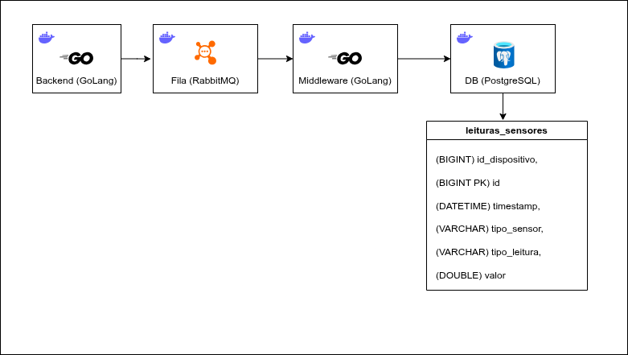

# Ponderada Semana 07 - Caio de Alcantara Santos

## Contexto da atividade

Uma empresa de monitoramento industrial está modernizando sua operação com dispositivos embarcados que coletam dados de sensores distribuídos em diferentes ambientes. Esses dispositivos capturam leituras periódicas de variáveis físicas relevantes para o negócio, como temperatura, umidade, presença, vibração, luminosidade e nível de reservatórios. Parte dos sensores gera valores discretos (ligado/desligado, presença/ausência, aberto/fechado), enquanto outros produzem valores analógicos (medições contínuas em escala numérica).

Com o crescimento do número de dispositivos conectados, surgem desafios de escalabilidade, confiabilidade e desempenho no backend de ingestão. O sistema precisa lidar com alto volume de requisições simultâneas, evitando perda de dados em cenários de concorrência elevada. Para isso, foi adotada uma arquitetura desacoplada baseada em mensageria, reduzindo gargalos de processamento síncrono no endpoint HTTP.

## Objetivo da solução

Construir uma solução em Go para ingestão de telemetria de sensores com processamento assíncrono, contendo:

- Backend HTTP com endpoint `POST /sensor_data` para receber dados dos dispositivos.
- Encaminhamento das mensagens para fila RabbitMQ.
- Consumidor (middleware) para leitura em lote da fila.
- Persistência em banco relacional PostgreSQL.
- Ambiente totalmente conteinerizado com Docker Compose.
- Testes de carga com k6 e análise dos resultados.

## Arquitetura da solução

Fluxo principal:

`backend -> rabbitmq -> middleware -> postgresql`

Imagem de arquitetura:



## Modelo de dados

A tabela principal de persistência é `leituras_sensores`:

- `id` (BIGINT, PK, identity)
- `id_dispositivo` (BIGINT)
- `timestamp` (TIMESTAMP)
- `tipo_sensor` (VARCHAR)
- `tipo_leitura` (VARCHAR)
- `valor` (DOUBLE PRECISION)

Script de criação: `db/init.sql`.

## Decisões de implementação

- O backend não grava no banco diretamente durante a requisição HTTP.
- A API publica os dados em fila para desacoplar ingestão e persistência.
- O middleware consome mensagens em lote (até 5000), persistindo com transação.
- RabbitMQ e PostgreSQL rodam no mesmo ambiente via Docker Compose.
- Cada serviço foi limitado a `2GB` de RAM no compose, totalizando `8GB` para o stack principal.

## Como rodar o projeto

Pré-requisitos:

- Docker
- Docker Compose

Na raiz do projeto:

```bash
docker compose up -d --build
```

Parar os serviços:

```bash
docker compose down
```

## Como rodar cada componente do Docker Compose

### Backend

- Serviço: `backend`
- Porta exposta: `8080`
- Endpoint de saúde: `GET /health`
- Endpoint de ingestão: `POST /sensor_data`
- Variáveis principais:
	- `RABBITMQ_URL`
	- `RABBITMQ_QUEUE`
	- `PUBLISH_WORKERS`
	- `PUBLISH_BUFFER`

Subir apenas backend (dependências já sobem se necessário):

```bash
docker compose up -d backend
```

### RabbitMQ

- Serviço: `rabbitmq`
- Porta AMQP: `5672`
- Painel de gestão: `15672`
- Credenciais:
	- usuário: `app`
	- senha: `app123`

Subir apenas RabbitMQ:

```bash
docker compose up -d rabbitmq
```

### Middleware (consumer)

- Serviço: `middleware`
- Responsável por consumir a fila e gravar no PostgreSQL
- Variáveis principais:
	- `RABBITMQ_URL`
	- `RABBITMQ_QUEUE`
	- `POSTGRES_DSN`
	- `BATCH_SIZE`
	- `BATCH_FLUSH_INTERVAL`

Subir apenas middleware:

```bash
docker compose up -d middleware
```

### PostgreSQL

- Serviço: `postgres`
- Porta local: `5431` (mapeada para `5432` do container)
- Banco: `sensores`
- Usuário: `postgres`
- Senha: `postgres`
- Script de inicialização: `db/init.sql`

Subir apenas PostgreSQL:

```bash
docker compose up -d postgres
```

## Testes unitários

Foram criados testes unitários para `backend` e `middleware`, cobrindo handlers HTTP e funções utilitárias de configuração/parsing.

> Nesta etapa específica, os testes unitários foram elaborados com auxílio de IA.

Executar testes do backend:

```bash
cd backend
go test ./...
```

Executar testes do middleware:

```bash
cd middleware
go test ./...
```

## Testes de carga (k6)

Os testes de carga foram executados localmente para avaliar throughput, latência, taxa de erro e estabilidade sob aumento progressivo de requisições.

### Resultados consolidados

Este documento resume os testes de carga executados na rota `POST /sensor_data`, com validação de resposta da API e conferência de persistência no PostgreSQL.

Durante os testes, cada componente do sistema (`backend`, `middleware`, `postgres` e `rabbitmq`) foi executado com limite de `2GB` de RAM, totalizando `8GB` alocados no ambiente.

#### Configuração geral

- Ferramenta: `k6` (execução local)
- Endpoint testado: `http://localhost:8080/sensor_data`
- Payload: JSON com `id_dispositivo`, `timestamp`, `tipo_sensor`, `tipo_leitura` e `valor`
- Critério de aceitação: `http_req_failed < 5%`
- Verificação adicional: contagem de linhas no banco após os testes

#### Cenário 10k req/s

Parâmetros do teste:

- Rampa progressiva até `10.000 req/s`
- `stage_duration`: `10s`
- Duração total aproximada: `1m40s` (+ `10s` de graceful stop)

Resultado observado:

- `http_req_failed`: `0.00%` (aprovado no threshold)
- Requests totais: `499.938`
- Throughput médio: `~4.999 req/s`
- Latência `http_req_duration`: média `397µs`, p95 `~965µs`
- Status `200`: `100%`

Conclusão:

O sistema se manteve estável nesse perfil, sem falhas e com baixa latência. A evidência de banco confirma que os dados processados foram persistidos.

Evidências:

**Resultado do teste (terminal)**


**Contagem no banco (PostgreSQL)**


---

#### Cenário 20k req/s

Parâmetros do teste:

- Rampa progressiva até `20.000 req/s`
- `stage_duration`: `10s`
- Duração total aproximada: `2m30s` (+ `10s` de graceful stop)

Resultado observado:

- `http_req_failed`: `1.87%` (ainda dentro do threshold de 5%)
- Requests totais: `1.249.031`
- Throughput médio: `~8.326 req/s`
- Latência `http_req_duration`: média `1.04ms`, p95 `4.38ms`
- `dropped_iterations`: `795` (baixo para o volume executado)
- Status `200`: `98.12%`

Conclusão:

O sistema sustentou carga mais alta com pequena taxa de erro, mantendo latência baixa. A contagem no banco confirma persistência dos dados recebidos.

Evidências:

**Resultado do teste (terminal)**


**Contagem no banco (PostgreSQL)**


---

#### Resumo final

- Até `10k req/s`: comportamento estável, sem falhas.
- Até `20k req/s`: sistema continua funcional, com aumento controlado de falhas.
- Em ambos os cenários, as evidências no banco indicam gravação dos dados processados.

Extra (cenário exploratório):

Não foram registradas evidências visuais deste cenário, porém em um teste com rampa até `100k req/s` o sistema apresentou falha em aproximadamente `50%` das requisições.

## Próximos passos

- Programar um microcontrolador para enviar requisições reais de telemetria para o sistema, simulando na prática um cenário de cidade inteligente.